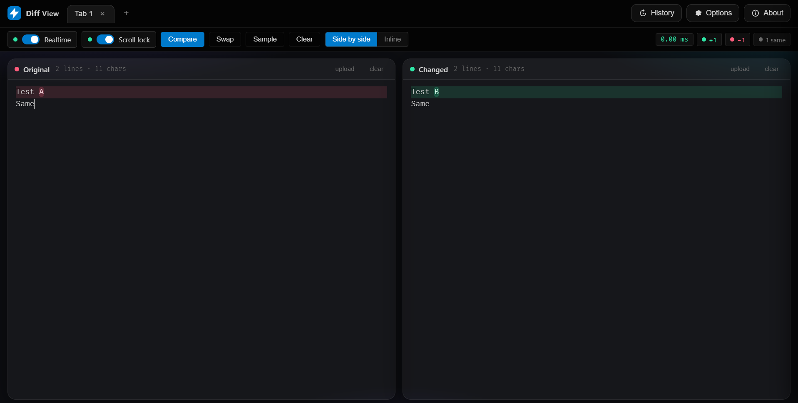

# DiffView


**DiffView** is a polished desktop diff viewer for Windows. It provides a focused side-by-side workspace for comparing text, reviewing changes, and keeping local diff work fast without sending content to a web service.



> ## Features

- **Side-by-Side Diffing:** Compare text in a dedicated desktop workspace.
- **Local First:** Runs as an Electron app and keeps comparison work on your machine.
- **Tray Integration:** Minimize to tray, restore quickly, and force quit from the tray menu.
- **State Persistence:** Remembers window size, position, and maximized state between sessions.
- **Focused UI:** A full-screen friendly interface without browser chrome or web clutter.

## Tech Stack

- **Language:** JavaScript
- **Runtime:** Electron
- **Packaging:** electron-builder
- **UI:** HTML, CSS, and browser-native APIs

## Installation

### Option 1: Download

1. Go to the [Releases](https://github.com/Offset0x/DiffView/releases) page.
2. Download the latest `DiffView` installer or portable `.exe`.
3. Run the application.

### Option 2: Build from Source

1. Clone the repository:
   ```powershell
   git clone https://github.com/Offset0x/DiffView.git
   cd DiffView
   ```

2. Install dependencies:
   ```powershell
   pnpm install
   ```

3. Start in development:
   ```powershell
   pnpm start
   ```

4. Build release artifacts:
   ```powershell
   pnpm release
   ```

## Notes

Runtime window state is stored in Electron's per-user app data directory. Build artifacts are generated in `dist/` and are intentionally ignored by git.
